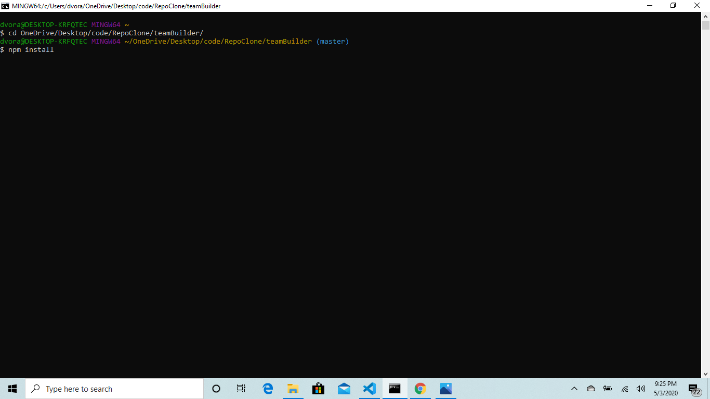
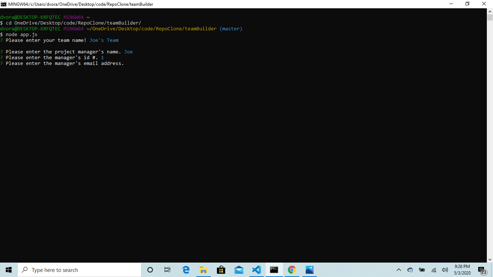

# TeamBuilder

This app generates an html file based on the user's input in the terminal to display information about a development team. A link to the deployed version can be found [here.](https://dvorakjt.github.io/teamBuilder/)
## Table of Contents

[Introduction](#introduction)  
[Installation](#installation)  
[Usage](#usage)
[Code](#code)  
[Tests](#tests)  
[Contributing](#contributing)  
[License](#license)  
[About the Author](#about-the-author)  

## Introduction

  

This app was completed as a homework for the Penn Full-Stack Coding Boot Camp. We were provided with certain boilerplate code to get us going, including the test files, and the htmlRenderer file. My task was to add javascript files containing classes that described employees and various permutations thereof that passed the tests, and then use these classes to construct an app that takes in user input and generates a visually appealing html file that lists all the members of the team the user constructed.

## Installation


To install the app, clone the repository and cd into its directory in the terminal. From there, run npm install to make sure all of the dependencies in the package.json file are installed. Then enter the command node app.js and the application will run. If you would like to run any of the tests, enter the command npm run test.

### Dependencies

Dependencies: Inquirer; Dev-Dependencies: Jest

## Usage


Using the application is very straightforward. Simply open the terminal, cd into the application's directory and enter node app.js. From there, you will receive a series of prompts related to the members of your team. For each team member you will need to provide their name, email and id number. For managers, you will also need to provide their office number. For engineers, you will also need to provide their github username. For interns, you will need to provide their school. You can enter as many employees as you wish. Once you are done, a file will be saved to the output folder. One thing to note is that the background image is located a directory up, and in the Assets folder. Therefore, if you move the generated html file into a different directory, make sure to also copy the background image and update the html file with the corresponding directory. The url for the background image is found in line 13 of the generated html.

## Code

This project is written using JavaScript and HTML (with some CSS sprinkled in directly into the HTML). The Bulma CSS Framework is also used.

The JavaScript files that I wrote are the class definitions (Employee, Manager, Engineer, Intern) and the actual app.js file. The app.js file uses the Inquirer NPM package to ask the user a series of questions relating to each employee. They are asked for the employees name, id, and email. Each of the subclasses of Employee each have their own specific fourth prompt that is asked. To fill in these properties for a new instance of each class, I used this neat one-liner (I researched how to fill several variables with the same property on Stack Overflow, and then combined that with object destructuring to uniquely assign values to name, role, id and email all in one line):  
    ```js
    const [{ role }, { name }, { id }, { email }] = Array(4).fill(answers);
    ```
From there, different functions are run depending on what the employee's role is.

Once the employees array is filled, the render function is called create an html file using the array. The render function was mostly pre-coded by Trilogy for this assignment, but I did optimize so that the html page that is generated would look nice.

This is the code I added:  
    ```js
        /*because the boiler plate code returns an html array which itself contains 3 arrays containing the different classes,
        I needed to concatenate these three arrays into one to be able to loop through it item by item.*/
        html = html[0].concat(html[1], html[2]);
        for (let i = 0; i < html.length; i++) {
            //after every fourth html element in the array, close the previous "level" div and create a new one
            const j = i % 4;
            if (i >= 4 && j === 0) {
                formattedHtml.push(`</div><div class="level">`);
            }
            //push the next html element into the formatted html array
            formattedHtml.push(html[i]);
        }
        //return the formatted array joined into a string
        return renderMain(formattedHtml.join(""));
        };

## Tests

Each of the classes in this app were tested using Jest. while building each class, I installed Jest globally so that I could test each class individually, for example "jest Engineer.test.js" I then used npm run test to test all the classes together.

## Contributing

If you notice any errors in the code, please submit a Github issue. 

## License
### TeamBuilder is licensed with an MIT license.


## About the Author

Joe Dvorak

Github: dvorakjt

Github repository: [github.com/dvorakjt](https://github.com/dvorakjt/)

Portfolio: [dvorakjt.github.io/](https://userName.github.io/)

README generated by GeneREADME. Original template written with [StackEdit](https://stackedit.io/). Badges provided through shields.io.
